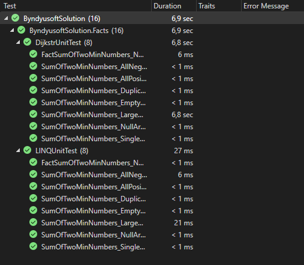

# ByndyusoftTestTask

# Задача
Напишите функцию, на вход которой приходит массив чисел. Функция возвращает сумму двух минимальных элементов массива.
Например, если дан массив [4, 0, 3, 19, 492, -10, 1], то результатом будет -10, потому что два минимальных числа -10 и 0, а их сумма -10.
Напишите минимум 3 модульных теста на эту функцию.
HINT: учти, что массив может быть пустым, или без цифр или состоять из 100 млн. элементов, поэтому надо учесть разные граничные условия.

## Решение

В качестве решения был реализован метод поска путём перичной быстрой сортировки Дейкстра. Так как массив не отсортированный, то не можем применить поиск используя более быстрые алгоритмы и в этом нет смысла, ведь в остортированном массиве уже можно получить два минимальных значения.

Для сравнения сортировки и способов раелизации поиска встроенными средствами C# сделан метод с использованием LINQ выражений.

Результаты теста представлены на скриншоте.

